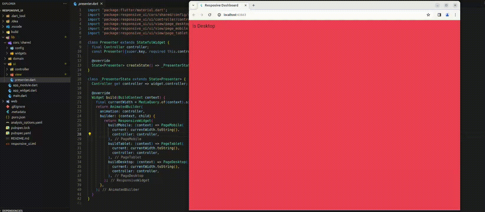

# Responsivo UI



## Estrutura de Diretórios
``` 
.
├── lib
│   ├── core
│   │   ├── responsive_widget.dart   
│   │   └── size_config.dart  
│   ├── ui
│   │   └── view
│   │       ├── page_desktop.dart
│   │       ├── page_mobile.dart
│   │       └── page_tablet.dart  
│   └── presenter.dart
└─...
```

### Implementando o Widget Responsivo

Crie um widget responsivo que determine dinamicamente qual layout usar com base no tamanho do dispositivo.
 
``` dart
  final Widget Function(BuildContext context) buildMobile;
  final Widget Function(BuildContext context) buildTablet;
  final Widget Function(BuildContext context) buildDesktop;
```
Iremos chamar o retorno da sua classe para declarar uma restrição de cada

``` dart
 @override
  Widget build(BuildContext context) {
    final SizeConfig sizeConfig = SizeConfig(context);
    if (sizeConfig.isMobile) {
      return buildMobile(context);
    } else if (sizeConfig.isTablet) {
      return buildTablet(context);
    } else {
      return buildDesktop(context);
    }
  }
```

### Criando Layouts Específicos

Crie layouts específicos para cada dispositivos móveis, tablets e desktops.

``` dart
import 'package:flutter/material.dart';

class Page extends StatelessWidget {
  @override
  Widget build(BuildContext context) {
    return Container();
  }
}
```


### Utilizando o Widget Responsivo

Em suas páginas, utilize o widget ResponsiveWidget para determinar o layout com base no tamanho do dispositivo.

``` dart
import 'package:flutter/material.dart';
import 'package:responsive_ui/cors/shared/config/responsive_widget.dart';
import 'package:responsive_ui/ui/controller/controller.dart';
import 'package:responsive_ui/ui/view/page_desktop.dart';
import 'package:responsive_ui/ui/view/page_mobile.dart';
import 'package:responsive_ui/ui/view/page_tablet.dart';

class Presenter extends StatefulWidget {
  final Controller controller;
  
  @override
  State<Presenter> createState() => _PresenterState();
}

class _PresenterState extends State<Presenter> {
  Controller get controller => widget.controller;

  @override
  Widget build(BuildContext context) {
    final currentWidth = MediaQuery.of(context).size.width;
    return AnimatedBuilder(
      animation: controller,
      builder: (context, child) {
        return ResponsiveWidget(
          buildMobile: (context) => PageMobile(),
          buildTablet: (context) => PageTablet(),
          buildDesktop: (context) => PageDesktop(),
        );
      },
    );
  }
}
```

### Testando a Responsividade

[Responsive UI](https://responsive-ui-eight.vercel.app/) : observe como a interface de usuário se adapta automaticamente ao tamanho da tela.


### Conclusão

Agora você tem uma UI responsiva em seu aplicativo Flutter, capaz de se adaptar dinamicamente ao tamanho do dispositivo em que está sendo executado. Isso proporciona uma experiência consistente e agradável para os usuários em todos os dispositivos.